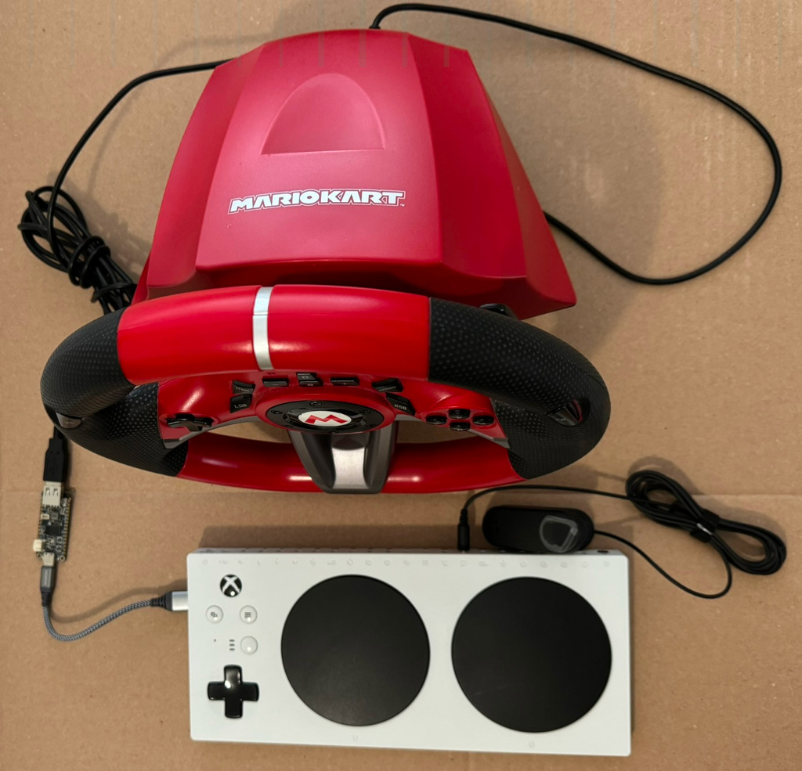
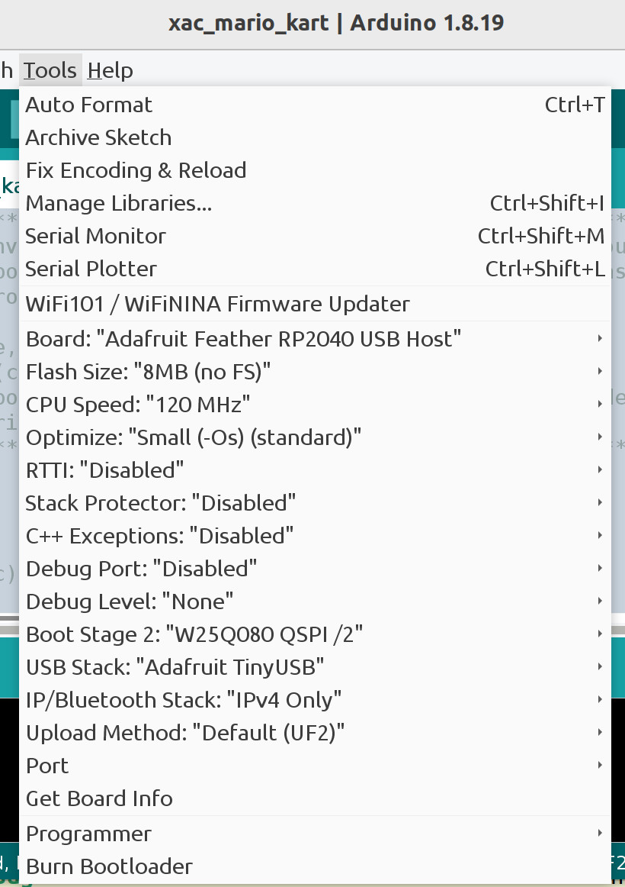
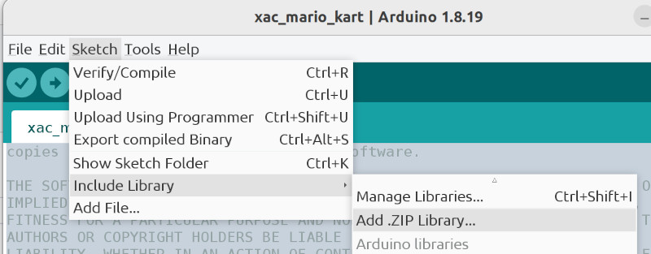

# Connect Hori Mario Kart Racing Wheel to XAC



This project connects a Hori Mario Kart Racing Wheel to an Xbox Adaptive
Controller. The Kart wheel controls the XAC left joystick X axis. The Kart
dpad controls the XAC dpad. The gas and brake are controlled by variable
triggers plugged into the XAC RT/LT jacks. This allows drivers who are not able
to use foot pedals to join the fun. Most of the Kart buttons map to XAC buttons.
The Xbox Accessory app can remap the buttons as desired.

The second reason for this project is to watch reactions to a Mario Kart wheel
on an Xbox One console.

Note: The project does not make the Mario Kart game run on Xbox.

Other wheels probably will not work but the Arduino souce code is included.
There is a Mario Kart Mini Racing Wheel but it may not work the same. I doubt
expensive Logitech, Thrustmaster, etc. racing wheels work with this project.

The Kart gas and brake foot pedals are not supported because the XAC USB
interface does not pass trigger values. The "Logitech G Adaptive Gaming Kit for
the Xbox Adaptive Controller" includes two variable triggers. Plug these into
the XAC RT and LT jacks to control gas and brake. If you are handy with
crafting, mount the triggers to the wheel so the driver can keep both hands on
the wheel while controlling gas and brake.

## Hardware

* Adafruit Feather RP2040 with USB Type A Host
* Nintendo Switch Mario Kart Racing Wheel Pro Deluxe By HORI
* Logitech G Adaptive Gaming Kit for the Xbox Adaptive Controller
* Microsoft Xbox Adaptive Controller

## Quick Start

The uf2 directory contains the firmware for the Adafruit board.
Put the Adafruit in bootload mode using the two buttons as described
[here](https://learn.adafruit.com/adafruit-feather-rp2040-with-usb-type-a-host/pinouts#buttons-and-rst-pin-3143253)
When the Flash drive named RPI-RP2 appears, drag and drop the uf2 file on the drive.
Wait a few seconds for the firmware update to finish. The RPI-RP2 will disappear.
The board is ready to be plugged into the XAC.

## Arduino Software

If you change the source code, it can rebuilt using the Arduino IDE or
compatible development system.

See [this
tutorial](https://learn.adafruit.com/adafruit-feather-rp2040-with-usb-type-a-host/arduino-ide-setup)
for details on installing Arduino support for the Adafruit board

Arduino IDE 1.8.19 board options. 



The non-default options are listed below.

```
Board: Adafruit Feather RP2040 USB Host
CPU Speed: 120 MHz
USB Stack: Adafruit TinyUSB
```

### Libraries

The following libraries can be installed using the IDE Library Manager.

* Adafruit TinyUSB Library by Adafruit
* Pico PIO USB by sekigon-gonnoc

The following must be installed by downloading it as a ZIP file. Then use the
IDE "Add .ZIP Library" feature to install it.

* https://github.com/touchgadget/flight_stick_tinyusb


